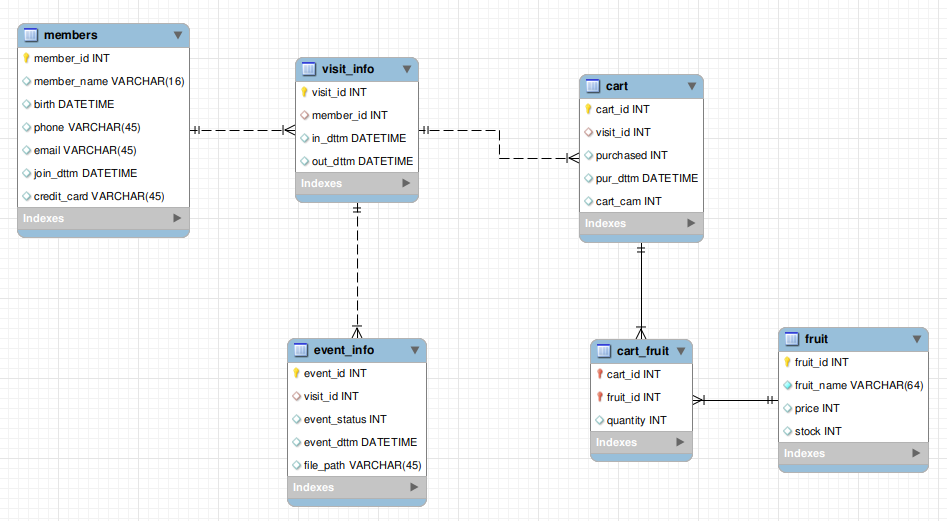

# 🧠 실시간 TCP 서버 & DB
이 리포지토리는 여러 장치에서 전송하는 JSON 형식의 요청을 TCP 서버가 실시간으로 수신하고,  
각 이벤트에 따라 관련 엔터티의 상태를 갱신한 뒤, 이벤트 유형에 따라 즉시 또는 일정 간격으로 데이터를 DB에 저장하는 시스템입니다.

## 📡 통신 프로토콜
| 이벤트           | 상세                                  | 예시 JSON                                                                    |
| ------------- | ----------------------------------- | -------------------------------------------------------------------------- |
| 고객 입장         | 고객이 매장에 입장함을 카메라로 인식하고 방문 기록을 생성    | `{ "camera_id": "Face", "member_id": 1, "action": "visit" }`               |
| 결제 전 카트 확인    | 고객이 결제대 카메라에 얼굴을 인식시켜 결제 준비를 요청함    | `{ "camera_id": "Face", "member_id": 1, "action": "purchase" }`            |
| 결제 승인         | 고객이 물품 목록을 확인한 후 '예' 버튼을 눌러 구매를 확정함 | `{ "camera_id": "Face", "member_id": 1, "action": "yes" }`                 |
| 카트에 담긴 물품 데이터 | 장바구니별 과일 정보 목록을 전송하여 장바구니 상태를 업데이트함  | `{ "camera_id": "Cart", "data": [ { "cart_cam": 1, "fruits": [...] } ] }`  |
| 매대에 놓인 물품 데이터 | 매대에 진열된 과일의 현재 재고 상태를 업데이트함     | `{ "camera_id": "Fruit", "data": [ { "fruit_id": 1, "stock": 3 }, ... ] }` |

## 🗄️ 데이터베이스

## 💡 메모리 객체 기반 상태 관리

이 시스템은 모든 주요 엔터티(Visitor, Cart, Fruit)를 **클래스 형태의 메모리 객체로 항상 유지**합니다.

- 이벤트가 발생하면 DB를 조회하지 않고 **객체 상태를 기준으로 처리**
- 이를 통해 **지연 없이 실시간 반응**이 가능하며,  
  반복 조회로 인한 **DB 부하를 최소화**합니다.

## 💾 데이터 저장 전략

| 항목 | 설명 |
|-----------|------|
| **중요 이벤트 (입장, 결제)** | 처리 즉시 DB에 저장 (트랜잭션 적용) |
| **빈번한 이벤트 (장바구니 등)** | 메모리 객체만 갱신 후, 일정 간격으로 일괄 저장 (batch insert) |
| **예외 발생 시** | 트랜잭션 rollback으로 데이터 정합성 유지 |

